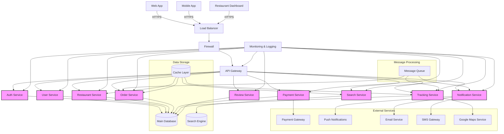
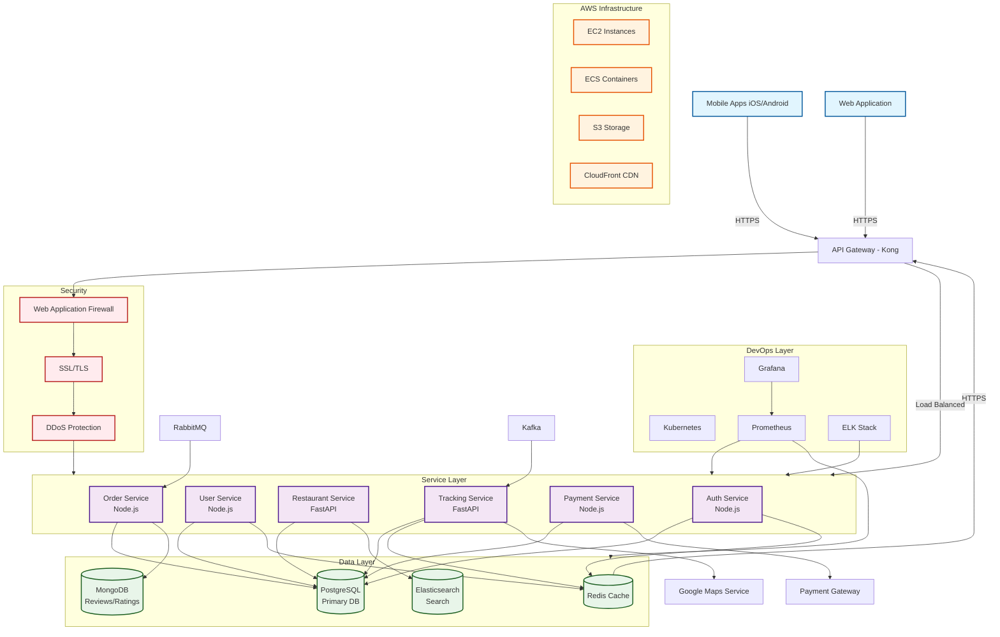
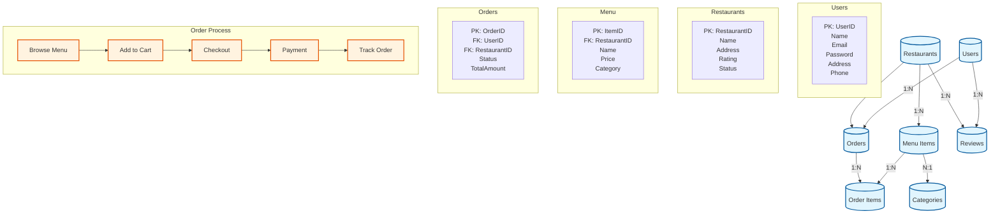
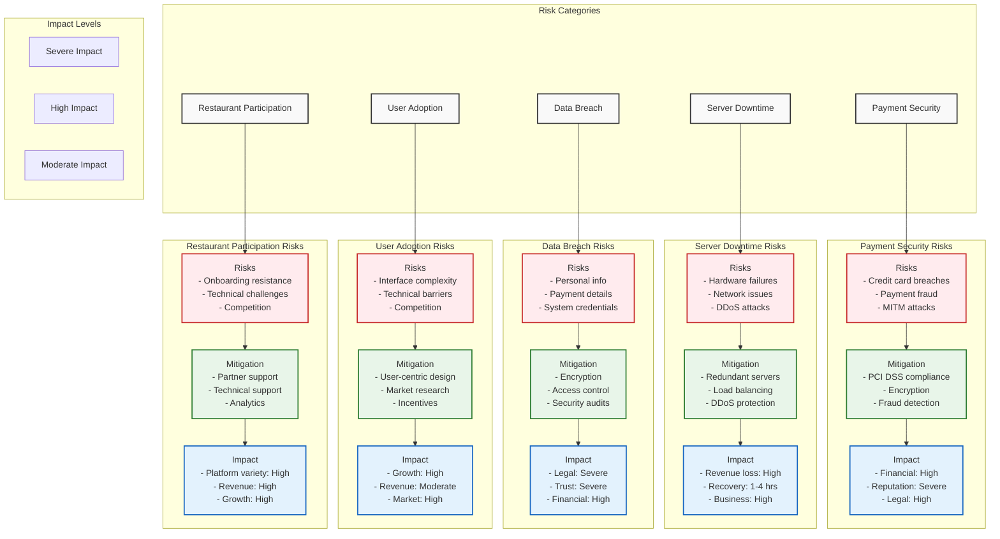
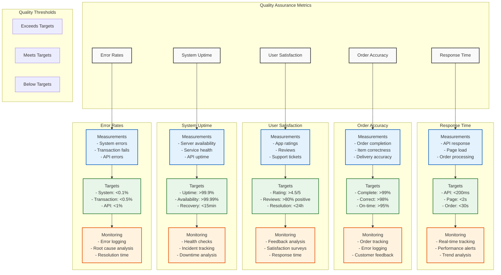
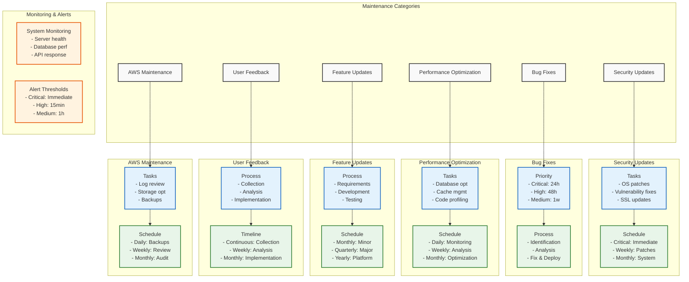

# OFFICIAL DOCUMENTATION

## Table of Contents
- [Requirment Engineering](#requirment-engineering)
- [System Architecture](#system-architecture)
- [Database Design](#database-design)
- [Use Cases](#use-cases)
- [Testing Strategy](#testing-strategy)
- [Implementation Phases](#implementation-phases)
- [Risk Analysis](#risk-analysis)
- [Quality Assurance](#)
- [Maintenance Plan](#maintenance-plan)

## REQUIREMENT ENGINEERING

### A. Functional Requirements:
- User registration/login
- Menu browsing and search
- Cart management
- Order placement
- Payment processing
- Real-time order tracking
- Delivery status updates
- Order history
- Restaurant management interface
- Rating/review system




#### User registration/login
```sql_more
1.1 Description:
System shall provide user authentication and account management capabilities.

1.2 Input:
- User personal information
- Email address
- Password
- Phone number
- Delivery address

1.3 Processing:
- Validate input data
- Check email uniqueness
- Encrypt password
- Generate user ID
- Create user profile

1.4 Output:
- User account creation confirmation
- Login success/failure message
- Authentication token
- User session

1.5 Error Handling:
- Invalid email format
- Weak password
- Duplicate email
- Failed login attempts
```

#### Menu Browsing and Search
```asciidoc
2.1 Description:
System shall allow users to view and search restaurant menus.

2.2 Input:
- Search keywords
- Filters (cuisine, price, rating)
- Location
- Sort preferences

2.3 Processing:
- Query menu database
- Filter results
- Sort by relevance
- Apply user preferences

2.4 Output:
- List of matching items
- Menu categories
- Item details
- Pricing information

2.5 Error Handling:
- No results found
- Invalid search criteria
- Location not served
```

#### Cart Management
```asciidoc
3.1 Description:
System shall manage shopping cart operations.

3.2 Input:
- Item selection
- Quantity
- Special instructions
- Modifications

3.3 Processing:
- Calculate total price
- Apply discounts
- Validate inventory
- Update cart status

3.4 Output:
- Cart summary
- Total amount
- Item list
- Delivery estimate

3.5 Error Handling:
- Item unavailable
- Invalid quantity
- Maximum limit exceeded
```

#### Order Placement
```asciidoc
4.1 Description:
System shall process and confirm food orders.

4.2 Input:
- Delivery address
- Payment method
- Time preference
- Special instructions

4.3 Processing:
- Validate order details
- Check restaurant availability
- Calculate delivery time
- Process payment

4.4 Output:
- Order confirmation
- Estimated delivery time
- Receipt
- Tracking number

4.5 Error Handling:
- Payment failure
- Restaurant closed
- Delivery unavailable
- Invalid address
```

#### Payment Processing
```asciidoc
5.1 Description:
System shall handle secure payment transactions.

5.2 Input:
- Payment method details
- Billing address
- Amount
- Tips

5.3 Processing:
- Validate payment info
- Process transaction
- Generate receipt
- Update order status

5.4 Output:
- Payment confirmation
- Transaction ID
- Digital receipt
- Payment status

5.5 Error Handling:
- Invalid card
- Insufficient funds
- Transaction timeout
- Gateway errors
```

#### Real-Time Order Tracking
```asciidoc
6.1 Customer Features
- Live map view showing delivery agent's current location
- Estimated time of arrival (ETA) updates every 30 seconds
- Push notifications for significant status changes
- Track multiple orders simultaneously
- Historical tracking data retention

6.2 Delivery Agent Features
- Automatic location updates every 10 seconds
- Status update options (Picked up, In transit, Nearby, Delivered)
- Route optimization suggestions
- Ability to communicate with customer through app
- Offline mode with data synchronization

6.3 Notification System
- Push notifications
- SMS alerts
- Email updates
- In-app status changes
- Critical alert handling
```

#### Order History
```asciidoc
7.1 Customer View
- Complete order details
- Itemized receipts
- Payment information
- Delivery timestamps
- Re-order functionality
- Filtering and search options
- Export capabilities (PDF, CSV)
- 12-month history retention

7.2 Restaurant View
- Daily/weekly/monthly order logs
- Revenue reports
- Popular items analysis
- Peak hours identification
- Customer frequency data
- Export functionality
```

#### Restaurant Management Interface
```asciidoc
8.1 Menu Management
- Add/edit/delete menu items
- Price updates
- Category management
- Special offers creation
- Inventory tracking
- Item availability toggling
- Bulk upload/update features

8.2 Order Management
- Real-time order queue
- Order acceptance/rejection
- Preparation time management
- Special instructions handling
- Order modification capability
- Batch order processing

8.3Business Settings
- Operating hours management
- Delivery radius setting
- Pricing and tax configuration
- Payment method settings
- Staff account management
- Service availability control
```

#### Rating/Review System
9.1 Customer Features
- Star rating (1-5)
- Written reviews
- Photo upload capability
- Rating categories:
    * Food Quality
    * Delivery Time
    * Value for Money
    * Packaging
    * Service
- Edit/delete review option
- Response to restaurant replies

9.2 Restaurant Features
- Review response capability
- Rating analytics dashboard
- Review notification system
- Review filtering options
- Review export functionality

### B. Non-Functional Requirements:
- Performance: Response time < 3 seconds
- Security: Encrypted data transmission
- Reliability: 99.9% uptime
- Usability: Intuitive interface
- Scalability: Handle multiple concurrent users
- Privacy: User data protection

#### Performance
```
1.1 Response Time
    - API response: < 200ms
    - Page load: < 3 seconds
    - Search results: < 1 second
    - Real-time updates: < 500ms
    - Image loading: < 2 seconds
1.2Processing Capacity
    - Order processing: 1000/minute
    - Payment processing: 500/minute
    - Concurrent users: 100,000
    - Location updates: 10,000/minute
```
#### Security
```
2.1 Data Transmission
    - TLS 1.3 encryption
    - End-to-end encryption for payments
    - Secure WebSocket connections
    - API request encryption
    - Mobile app certificate pinning
2.2 Authentication
    - Multi-factor authentication
    - Session management
    - Token-based authentication
    - Rate limiting
    - Brute force protection
```

#### Reliability
```
3.1 System Uptime
    - 99.9% availability
    - Planned maintenance windows
    - Automatic failover
    - Load balancing
    - Disaster recovery plan
3.2 Data Integrity
    - Real-time data backup
    - Transaction consistency
    - Data validation
    - Error handling
    - Audit logging
```

#### Usability
```
4.1 Interface Requirements
    - Intuitive navigation
    - Consistent design patterns
    - Mobile-responsive design
    - Accessibility compliance
    - Multi-language support
    - Offline capability
    - Error prevention
4.2 User Experience
    - Maximum 3 clicks to order
    - Clear feedback messages
    - Progressive disclosure
    - Consistent terminology
    - Help documentation
```

#### Scalability
```
5.1 Technical Scalability
    - Horizontal scaling capability
    - Microservices architecture
    - Database sharding support
    - Caching implementation
    - Load balancer integration
5.2 Business Scalability
    - Multi-region support
    - Multi-currency support
    - Multi-language capability
    - API extensibility
    - Third-party integration capability
```

#### Privacy
```
6.1 Data Protection
    - GDPR compliance
    - Data encryption at rest
    - Personal data anonymization
    - Data retention policies
    - Right to be forgotten implementation
6.2 Access Control
    - Role-based access control
    - Data access logging
    - Privacy policy enforcement
    - Third-party data sharing controls
    - User consent management
```

## SYSTEM ARCHITECTURE
### A. Frontend:
- Mobile app (iOS/Android)
- Web interface
- Restaurant dashboard

### B. Backend:
- User management service
- Order processing service
- Payment gateway integration
- Real-time tracking service
- Database management




#### System Architecture Specification:
```asciidoc
================================

1. HIGH-LEVEL ARCHITECTURE
--------------------------

[Client Layer]
    │
    ├── Mobile Apps (iOS/Android)
    ├── Web Application (React)
    └── Restaurant Dashboard (React)
            │
            ▼
[API Gateway Layer] - Kong API Gateway
            │
            ▼
[Service Layer]
    │
    ├── Authentication Service
    ├── User Service
    ├── Restaurant Service
    ├── Order Service
    ├── Payment Service
    └── Tracking Service
            │
            ▼
[Data Layer]
    │
    ├── PostgreSQL (Primary Database)
    ├── Redis (Caching)
    ├── MongoDB (Reviews/Ratings)
    └── Elasticsearch (Search)

2. COMPONENT DETAILS
-------------------

2.1 Frontend Components
    
A. Mobile Apps (iOS/Android)
   - Framework: React Native
   - State Management: Redux
   - Key Features:
     * Offline capability
     * Push notifications
     * Location services
     * Payment integration

B. Web Application
   - Framework: React.js
   - State Management: Redux
   - UI Framework: Material-UI
   - Features:
     * Responsive design
     * PWA capabilities
     * Real-time updates

C. Restaurant Dashboard
   - Framework: React.js
   - Real-time order management
   - Analytics dashboard
   - Inventory management

2.2 Backend Services

A. Authentication Service
   - Technology: Node.js
   - Features:
     * JWT authentication
     * OAuth2 integration
     * Role-based access control
     * Session management

B. User Service
   - Technology: Node.js
   - Features:
     * Profile management
     * Address management
     * Preference settings
     * Order history

C. Restaurant Service
   - Technology: Python/FastAPI
   - Features:
     * Menu management
     * Inventory control
     * Restaurant analytics
     * Rating management

D. Order Service
   - Technology: Node.js
   - Features:
     * Order processing
     * Status management
     * Notification dispatch
     * Price calculation

E. Payment Service
   - Technology: Node.js
   - Features:
     * Payment gateway integration
     * Transaction management
     * Refund processing
     * Payment analytics

F. Tracking Service
   - Technology: Python/FastAPI
   - Features:
     * Real-time location tracking
     * Delivery ETA calculation
     * Geofencing
     * Route optimization

3. INFRASTRUCTURE DETAILS
-------------------------

3.1 Cloud Infrastructure (AWS)
    - EC2 for application servers
    - ECS for containerization
    - RDS for PostgreSQL
    - ElastiCache for Redis
    - S3 for static assets
    - CloudFront for CDN

3.2 DevOps Setup
    - Container Orchestration: Kubernetes
    - CI/CD: Jenkins
    - Monitoring: Prometheus + Grafana
    - Logging: ELK Stack
    - Service Mesh: Istio

4. COMMUNICATION PATTERNS
------------------------

4.1 Synchronous Communications
    - REST APIs
    - GraphQL (for complex queries)
    - gRPC (for internal services)

4.2 Asynchronous Communications
    - Message Queue: RabbitMQ
    - Event Bus: Apache Kafka
    - WebSocket for real-time updates

5. SECURITY ARCHITECTURE
-----------------------

5.1 Security Measures
    - API Gateway security
    - SSL/TLS encryption
    - Data encryption at rest
    - WAF implementation
    - DDoS protection
    - Rate limiting

5.2 Authentication/Authorization
    - OAuth2.0
    - JWT tokens
    - Role-based access
    - API keys for partners

6. SCALABILITY DESIGN
--------------------

6.1 Horizontal Scaling
    - Microservices architecture
    - Containerization
    - Load balancing
    - Database sharding

6.2 Caching Strategy
    - Application-level caching
    - Database caching
    - CDN caching
    - API response caching

7. DISASTER RECOVERY
-------------------

7.1 Backup Strategy
    - Database backups
    - Configuration backups
    - Code repository backups

7.2 Recovery Plans
    - Failover procedures
    - Data recovery processes
    - Business continuity plans
```


## DATABASE DESIGN



Key Entities:
```sql
Users:
- UserID (PK)
- Name
- Email
- Password
- Address
- Phone

Restaurants:
- RestaurantID (PK)
- Name
- Address
- Rating
- Menu

Menu:
- ItemID (PK)
- RestaurantID (FK)
- Name
- Description
- Price
- Category

Orders:
- OrderID (PK)
- UserID (FK)
- RestaurantID (FK)
- Status
- TotalAmount
- DeliveryAddress
- Timestamp
```

## USE CASES
### Primary Use Cases:
- Customer Registration
- Browse Restaurant/Menu
- Place Order
- Track Order
- Payment Processing
- Review/Rating
- Order History View


#### Customer Registration
Actor: New Customer

Main Flow:
1. Customer opens registration page
2. System displays registration form
3. Customer enters:
    - Full name
    - Email address
    - Phone number
    - Password
    - Address details
4. System validates:
    - Email format
    - Password strength
    - Phone number format
    - Required fields
5. System sends verification code
6. Customer enters verification code
7. System creates account
8. System sends welcome email
Alternative Flows:
    - Email already exists
    - Invalid verification code
    - Validation failures
    - Network timeout

#### Browse Restaurant/Menue
Actor: Customer
Main Flow:
1. Customer opens restaurant listing
2. System displays:
    - Featured restaurants
    - Categories
    - Search options
    - Filters (cuisine, rating, price)
3. Customer selects restaurant
4. System displays:
    - Restaurant details
    - Operating hours
    - Delivery time
    - Menu categories
    - Special offers
5. Customer browses menu items
6. System shows:
    - Item details
    - Prices
    - Customization options
    - Availability status
Alternative Flows:
    - No restaurants available
    - Restaurant closed
    - Items out of stock
    - Location not serviceable

#### Track Order
Actor: Customer

Main Flow:
1. Customer opens order tracking
2. System displays:
    - Order status
    - Restaurant preparation
    - Delivery agent location
    - ETA
3. Customer receives updates for:
    - Order confirmation
    - Preparation start
    - Preparation complete
    - Pickup
    - Delivery progress
4. Customer views live location
5. System updates ETA
6. Order delivery confirmation
Alternative Flows:
    - Delivery delays
    - GPS issues
    - Order cancellation
    - Technical failures

#### Payment Processing
Actor: Customer

Main Flow:
1. Customer selects payment method
2. System displays options:
    - Credit/debit card
    - Digital wallet
    - Cash on delivery
    - Saved cards
3. Customer enters payment details
4. System validates details
5. System processes payment
6. System confirms transaction
7. System generates receipt
Alternative Flows:
    - Payment decline
    - Network timeout
    - Invalid card
    - Processing error

#### Review/Rating
Actor: Customer

Main Flow:
1. Customer opens completed order
2. System displays rating form
3. Customer provides:
    - Star rating
    - Written review
    - Photos (optional)
    - Specific ratings
        * Food quality
        * Delivery time
        * Value for money
4. System validates submission
5. System updates restaurant rating
Alternative Flows:
    - Rating timeout period
    - Upload failures
    - Edit/delete review
    - Restaurant response

#### Order History View
Actor: Customer

Main Flow:
1. Customer opens order history
2. System displays:
    - Past orders
    - Order details
    - Status information
    - Payment details
3. Customer can:
    - View detailed receipt
    - Download invoice
    - Reorder items
    - Track active orders
Alternative Flows:
    - No order history
    - Failed data retrieval
    - Filter/sort issues
    - Export failures

## TESTING STRATEGY

A. Unit Testing:
- Individual component testing
- API endpoint testing
- Database query testing

B. Integration Testing:
- Payment gateway integration
- Order flow testing
- Real-time tracking testing

C. User Acceptance Testing:
- End-to-end order flow
- User interface testing
- Performance testing

### A. Unit Testing
#### Individual Component Testing
- Component-level test cases:
    * User registration validation
    * Cart calculations
    * Address validation
    * Payment amount calculation
    * Rating calculation
    * Search functionality
    * Filter operations

#### API Endpoint Testing
- Endpoint test scenarios:
    * Authentication endpoints
    * Restaurant listing endpoints
    * Order management endpoints
    * Payment endpoints
    * User profile endpoints
    * Review endpoints

#### Database Query Testing
- Query performance tests:
    * CRUD operations
    * Complex joins
    * Transaction handling
    * Concurrent access
    * Data integrity checks

### B. Integration Testing
#### Payment Gateway Integration
- Test scenarios:
    * Successful payment flow
    * Failed payment handling
    * Refund processing
    * Payment timeout
    * Multiple payment methods
    * Transaction logging
    * Security validation

#### Order Flow Testing
- Integration points:
    * Order creation to restaurant
    * Restaurant to delivery agent
    * Payment to order status
    * Notification system
    * Real-time updates
    * Status synchronization

#### Real-time Tracking Testing
- Testing aspects:
    * Location accuracy
    * Update frequency
    * Multiple order tracking
    * offline handling
    * Performance under load
    * Data consistency

### User Acceptance Testing 
#### End-to-end Order Flow
- Test scenarios:
    * Complete order placement
    * Payment processing
    * Order tracking
    * Delivery completion
    * Review submission
    * Order history update

#### User Interface Testing
- Testing aspects:
    * Responsive design
    * Cross-browser compatibility
    * Mobile responsiveness
    * Accessibility compliance
    * Error messages
    * Loading states

#### Performance Testing
- Test types:
    * Load testing
    * Stress testing
    * Endurance testing
    * Spike testing
    * Scalability testing
    * Reliability testing

## IMPLEMENTATION PHASES

Phase 1:
- Basic user registration
- Restaurant listing
- Menu display
- Simple order placement

Phase 2:
- Payment integration
- Order tracking
- Review system
- Restaurant dashboard

Phase 3:
- Advanced features
- Analytics
- Optimization
- Scale-up

## RISK ANALYSIS

Potential Risks:
- Payment security
- Server downtime
- Data breach
- User adoption
- Restaurant participation




### Payment Security Risks
#### Identified Risks
- Credit card data breaches
- Payment fraud attempts
- Man-in-the-middle attacks
- SQL injection attacks
- API vulnerabilities
- Unauthorized transactions

#### Mitigation Strategies
- PCI DSS compliance implementation
- End-to-end encryption
- Tokenization of payment data
- Real-time fraud detection
- Regular security audits
- Multi-factor authentication

#### Impact Assessment
- Financial loss potential: High
- Reputation damage: Severe
- Legal implications: High
- Recovery time: 1-3 months
- Customer trust impact: Severe

### Server Downtime
#### Risk Factors
- Hardware failures
- Network issues
- Database crashes
- Traffic spikes
- DDoS attacks
- System updates

#### Mitigation Strategies
- Redundant server setup
- Load balancing
- Automated failover
- Regular backups
- DDoS protection
- Performance monitoring

#### Impact Assessment
- Revenue loss per hour: High
- User experience impact: Severe
- Order fulfillment delay: Moderate
- Recovery time: 1-4 hours
- Business continuity impact: High

### Data Breach
#### Vulnerable Areas
- User personal information
- Payment details
- Order history
- Location data
- Business intelligence
- System credentials

#### Protection Measures
- Data encryption at rest
- Network security
- Access control
- Regular security audits
- Incident response plan
- Employee training

#### Impact Assessment
- Legal liability: Severe
- Customer trust: Severe
- Financial impact: High
- Recovery time: 3-6 months
- Regulatory consequences: High

### User Adoption
#### Risk Factors
- Interface complexity
- Technical barriers
- Competition
- Market resistance
- User experience issues
- Price sensitivity

#### Mitigation Strategies
- User-centric design
- Market research
- Competitive analysis
- User feedback loops
- Marketing campaigns
- Incentive programs

#### Impact Assessment
- Growth impact: High
- Revenue impact: Moderate
- Market share: High
- Recovery time: 6-12 months
- Investment loss: Moderate

### Restaurant Participation
#### Risk Factors
- Onboarding resistance
- Commission structure
- Technical challenges
- Operational integration
- Competition
- Resource constraints

#### Mitigation Strategies
- Partner support program
- Training and onboarding
- Competitive commission
- Technical support
- Business analytics
- Success stories

#### Impact Assessment
- Platform variety: High
- User satisfaction: Moderate
- Revenue impact: High
- Market coverage: Severe
- Growth limitation: High

## QUALITY ASSURANCE (no need to cover for the PPT)

Metrics:
- Response time
- Order accuracy
- User satisfaction
- System uptime
- Error rates



## MAINTENANCE PLAN

Regular:
- Security updates
- Bug fixes
- Performance optimization
- Feature updates
- User feedback implementation
- AWS bucket (cloud database maintenance)




### Security Updates
#### Regular Updates
- Operating system patches
- Security vulnerability fixes
- Dependency updates
- SSL certificate renewal
- Firewall rule updates
- Security policy updates

#### Schedule
- Critical updates: Immediate
- Security patches: Weekly
- System updates: Monthly
- Policy reviews: Quarterly
- Full security audit: Annually

### Bug Fixes
#### Priority Levels
- Critical (24h response)
- High (48h response)
- Medium (1 week response)
- Low (2 week response)

#### Process
- Issue identification
- Impact assessment
- Root cause analysis
- Fix development
- Testing
- Deployment
- Monitoring

### Performance Optimization
#### Regular Tasks
- Database optimization
- Cache management
- Code profiling
- Resource utilization
- Network optimization
- Query optimization

#### Schedule
- Daily monitoring
- Weekly analysis
- Monthly optimization
- Quarterly review
- Annual assessment

### Feature Updates
#### Implementation Process
- Requirement gathering
- Impact analysis
- Development planning
- Testing strategy
- Rollout plan
- User communication

#### Schedule
- Minor updates: Monthly
- Major updates: Quarterly
- Platform upgrades: Annually

### User Feedback Implementation
#### Process Flow
- Feedback collection
- Analysis and prioritization
- Feature planning
- Development
- Testing
- Release

#### Timeline
- Collection: Continuous
- Analysis: Weekly
- Implementation: Monthly
- Review: Quarterly

### AWS Bucket Maintenance
#### Regular Tasks
- Access log review
- Storage optimization
- Backup verification
- Permission audit
- Cost optimization
- Performance monitoring

#### Schedule
- Daily backups
- Weekly storage review
- Monthly access audit
- Quarterly cost analysis
- Annual policy review

### Monitoring and Alerts
#### System Monitoring
- Server health
- Database performance
- API response times
- Error rates
- Resource utilization
- Security events

#### Alert Thresholds
- Critical: Immediate
- High: 15 minutes
- Medium: 1 hour
- Low: 24 hours