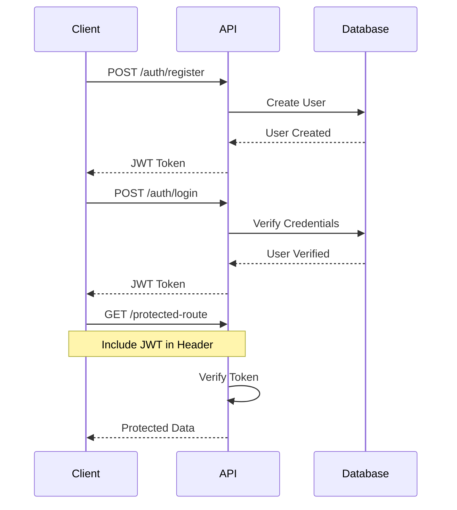
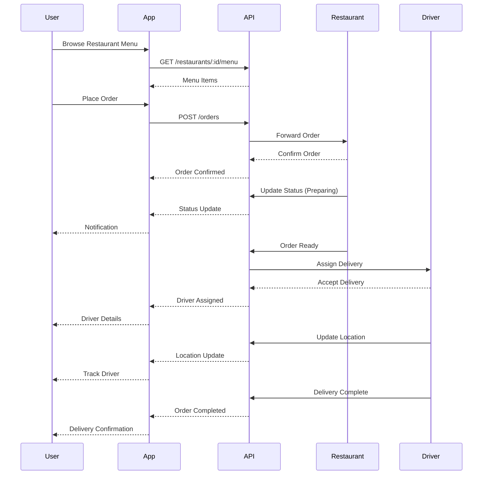
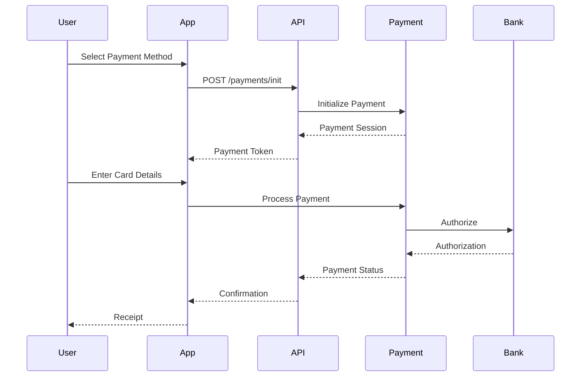

```markdown
# API Endpoints Reference

## Table of Contents
- [Overview](#overview)
- [Base URL](#base-url)
- [Authentication](#authentication)
- [Response Format](#response-format)
- [Error Handling](#error-handling)
- [Rate Limiting](#rate-limiting)
- [Endpoints](#endpoints)

## Overview
This document outlines all available endpoints in the Food Ordering & Tracking Application API.

## Base URL
```
Development: http://localhost:3000/api
Production: https://api.foodapp.com
```

## Authentication
Most endpoints require JWT authentication. Include the token in request headers:
```
Authorization: Bearer <your_jwt_token>
```

## Response Format
All responses follow this standard format:
```json
{
    "status": "success|error",
    "data": {}, 
    "message": "Operation successful",
    "error": null
}
```

## Error Handling
Common error codes:
```
400 - Bad Request
401 - Unauthorized
403 - Forbidden
404 - Not Found
500 - Internal Server Error
```

## Rate Limiting
- 100 requests per 15 minutes per IP
- 1000 requests per hour per authenticated user

## Endpoints

### Authentication
```
| Method | Endpoint | Description | Auth Required |
|--------|----------|-------------|---------------|
| POST | `/auth/register` | Register new user | No |
| POST | `/auth/login` | User login | No |
| GET | `/auth/profile` | Get user profile | Yes |
| PUT | `/auth/profile` | Update profile | Yes |
```

### Orders
```
| Method | Endpoint | Description | Auth Required |
|--------|----------|-------------|---------------|
| GET | `/orders` | List all orders | Yes |
| POST | `/orders` | Create new order | Yes |
| GET | `/orders/:id` | Get order details | Yes |
| PUT | `/orders/:id` | Update order | Yes |
| DELETE | `/orders/:id` | Cancel order | Yes |
```
### Restaurants
```
| Method | Endpoint | Description | Auth Required |
|--------|----------|-------------|---------------|
| GET | `/restaurants` | List restaurants | No |
| GET | `/restaurants/:id` | Get restaurant details | No |
| GET | `/restaurants/:id/menu` | Get restaurant menu | No |
| POST | `/restaurants/:id/reviews` | Add review | Yes |
```
### Users
```
| Method | Endpoint | Description | Auth Required |
|--------|----------|-------------|---------------|
| GET | `/users/me` | Get current user | Yes |
| PUT | `/users/me` | Update user details | Yes |
| GET | `/users/orders` | Get user orders | Yes |
| GET | `/users/favorites` | Get favorites | Yes |
```
### Detailed Endpoint Specifications

#### POST /auth/register
Create a new user account.

Request:
```json
{
    "email": "user@example.com",
    "password": "securepassword",
    "name": "John Doe",
    "phone": "+852 1234 5678"
}
```

Response:
```json
{
    "status": "success",
    "data": {
        "userId": "12345",
        "token": "jwt_token_here",
        "email": "user@example.com"
    }
}
```

#### POST /orders
Create a new food order.

Request:
```json
{
    "restaurantId": "rest123",
    "items": [
        {
            "itemId": "item123",
            "quantity": 2,
            "specialInstructions": "No onions"
        }
    ],
    "deliveryAddress": {
        "street": "123 Nathan Road",
        "district": "Mong Kok",
        "city": "Hong Kong"
    },
    "paymentMethod": "credit_card"
}
```

Response:
```json
{
    "status": "success",
    "data": {
        "orderId": "order123",
        "status": "pending",
        "estimatedDelivery": "2024-10-24T15:30:00Z"
    }
}
```

[Continue with other detailed endpoint specifications...]
```

Other detailed endpoint specifications:

```markdown
#### GET /orders/:id
Retrieve details of a specific order.

Request:
```json
// No request body needed
// URL Parameter: id (order ID)
```

Response:
```json
{
    "status": "success",
    "data": {
        "orderId": "order123",
        "status": "in_progress",
        "createdAt": "2024-10-24T14:30:00Z",
        "estimatedDelivery": "2024-10-24T15:30:00Z",
        "items": [
            {
                "itemId": "item123",
                "name": "Chicken Rice",
                "quantity": 2,
                "price": 88.00,
                "specialInstructions": "No onions"
            }
        ],
        "subtotal": 176.00,
        "deliveryFee": 30.00,
        "total": 206.00,
        "deliveryAddress": {
            "street": "123 Nathan Road",
            "district": "Mong Kok",
            "city": "Hong Kong"
        },
        "restaurant": {
            "id": "rest123",
            "name": "Good Food Restaurant",
            "phone": "+852 2345 6789"
        }
    }
}
```

#### GET /restaurants
List available restaurants with optional filters.

Request:
```json
// Query Parameters
{
    "district": "Mong Kok",
    "cuisine": "Chinese",
    "rating": "4",
    "isOpen": "true",
    "page": 1,
    "limit": 10
}
```

Response:
```json
{
    "status": "success",
    "data": {
        "restaurants": [
            {
                "id": "rest123",
                "name": "Good Food Restaurant",
                "cuisine": "Chinese",
                "rating": 4.5,
                "address": {
                    "street": "456 Nathan Road",
                    "district": "Mong Kok",
                    "city": "Hong Kong"
                },
                "isOpen": true,
                "deliveryTime": "30-45",
                "minimumOrder": 100.00,
                "deliveryFee": 30.00
            }
        ],
        "pagination": {
            "currentPage": 1,
            "totalPages": 5,
            "totalItems": 48
        }
    }
}
```

#### GET /restaurants/:id/menu
Get menu items for a specific restaurant.

Request:
```json
// Query Parameters
{
    "category": "main_dishes",
    "vegetarian": "true"
}
```

Response:
```json
{
    "status": "success",
    "data": {
        "restaurantId": "rest123",
        "categories": [
            {
                "name": "Main Dishes",
                "items": [
                    {
                        "id": "item123",
                        "name": "Vegetable Fried Rice",
                        "description": "Wok-fried rice with mixed vegetables",
                        "price": 88.00,
                        "isVegetarian": true,
                        "isSpicy": false,
                        "availableAddons": [
                            {
                                "id": "addon1",
                                "name": "Extra Vegetables",
                                "price": 10.00
                            }
                        ],
                        "imageUrl": "menu/item123.jpg"
                    }
                ]
            }
        ]
    }
}
```

#### POST /restaurants/:id/reviews
Submit a review for a restaurant.

Request:
```json
{
    "rating": 4.5,
    "comment": "Great food and fast delivery!",
    "orderId": "order123",
    "photos": ["review1.jpg", "review2.jpg"]
}
```

Response:
```json
{
    "status": "success",
    "data": {
        "reviewId": "review123",
        "createdAt": "2024-10-24T16:00:00Z",
        "status": "published"
    }
}
```

### Error Response Examples

#### 400 Bad Request
```json
{
    "status": "error",
    "error": {
        "code": "VALIDATION_ERROR",
        "message": "Invalid input parameters",
        "details": [
            {
                "field": "email",
                "message": "Invalid email format"
            }
        ]
    }
}
```

#### 401 Unauthorized
```json
{
    "status": "error",
    "error": {
        "code": "UNAUTHORIZED",
        "message": "Invalid or expired token"
    }
}
```

#### 404 Not Found
```json
{
    "status": "error",
    "error": {
        "code": "NOT_FOUND",
        "message": "Restaurant not found"
    }
}
```

#### 429 Too Many Requests
```json
{
    "status": "error",
    "error": {
        "code": "RATE_LIMIT_EXCEEDED",
        "message": "Too many requests",
        "retryAfter": 60
    }
}
```

### Authentication Flow



## Part 1 More Endpoint Specifications:

```markdown
#### GET /users/favorites
Get user's favorite restaurants and meals.

Request:
```json
// Query Parameters
{
    "type": "restaurants|meals",
    "page": 1,
    "limit": 20
}
```

Response:
```json
{
    "status": "success",
    "data": {
        "favorites": {
            "restaurants": [
                {
                    "id": "rest123",
                    "name": "Good Food Restaurant",
                    "lastOrdered": "2024-10-20T14:30:00Z",
                    "totalOrders": 5
                }
            ],
            "meals": [
                {
                    "id": "item456",
                    "name": "Dim Sum Set",
                    "restaurantId": "rest123",
                    "orderCount": 3
                }
            ]
        }
    }
}
```

#### PUT /users/me
Update user profile information.

Request:
```json
{
    "name": "John Doe",
    "phone": "+852 9876 5432",
    "deliveryAddresses": [
        {
            "label": "Home",
            "street": "123 Nathan Road",
            "district": "Mong Kok",
            "city": "Hong Kong",
            "isDefault": true
        }
    ],
    "preferences": {
        "emailNotifications": true,
        "pushNotifications": true,
        "language": "en",
        "currency": "HKD"
    }
}
```

Response:
```json
{
    "status": "success",
    "data": {
        "userId": "user123",
        "updated": true,
        "lastModified": "2024-10-24T16:30:00Z"
    }
}
```

#### POST /orders/:id/track
Update order tracking status.

Request:
```json
{
    "status": "preparing",
    "currentLocation": {
        "lat": 22.3193,
        "lng": 114.1694
    },
    "estimatedArrival": "2024-10-24T17:30:00Z"
}
```

Response:
```json
{
    "status": "success",
    "data": {
        "orderId": "order123",
        "tracking": {
            "status": "preparing",
            "timeline": [
                {
                    "status": "ordered",
                    "timestamp": "2024-10-24T16:00:00Z"
                },
                {
                    "status": "confirmed",
                    "timestamp": "2024-10-24T16:05:00Z"
                },
                {
                    "status": "preparing",
                    "timestamp": "2024-10-24T16:15:00Z"
                }
            ]
        }
    }
}
```

## Part 2 - Additional Error Scenarios:

```markdown
### Additional Error Scenarios

#### 403 Forbidden
```json
{
    "status": "error",
    "error": {
        "code": "INSUFFICIENT_PERMISSIONS",
        "message": "You don't have permission to access this resource",
        "requiredRole": "admin"
    }
}
```

#### 409 Conflict
```json
{
    "status": "error",
    "error": {
        "code": "RESOURCE_CONFLICT",
        "message": "Email already registered",
        "conflictingField": "email"
    }
}
```

#### 422 Unprocessable Entity
```json
{
    "status": "error",
    "error": {
        "code": "BUSINESS_RULE_VIOLATION",
        "message": "Order cannot be placed",
        "reasons": [
            "Restaurant is currently closed",
            "Minimum order amount not met",
            "Delivery address out of range"
        ]
    }
}
```

#### 500 Internal Server Error
```json
{
    "status": "error",
    "error": {
        "code": "INTERNAL_ERROR",
        "message": "An unexpected error occurred",
        "referenceId": "err_123456"
    }
}
```

## Part 3 - Additional Sequence Diagrams:


```markdown
### Order Flow




### Payment Flow



## Part 4 - Security Considerations:

```markdown
## Security Considerations

### API Security
1. **Rate Limiting**
   - IP-based: 100 requests per 15 minutes
   - Token-based: 1000 requests per hour
   - Endpoint-specific limits for sensitive operations

2. **Authentication**
   - JWT tokens with 24-hour expiry
   - Refresh token rotation
   - Multi-factor authentication for sensitive operations
   - Token blacklisting for logged-out sessions

3. **Data Protection**
   - All requests must use HTTPS
   - PII (Personally Identifiable Information) encryption at rest
   - Payment information handled through PCI-compliant service
   - Data masking in logs

4. **Input Validation**
   - Request payload size limits
   - Content-Type validation
   - Schema validation for all inputs
   - SQL injection prevention
   - XSS protection

5. **Output Security**
   - CORS configuration
   - Security headers:
     ```
     X-Content-Type-Options: nosniff
     X-Frame-Options: DENY
     X-XSS-Protection: 1; mode=block
     Strict-Transport-Security: max-age=31536000; includeSubDomains
     ```

6. **Error Handling**
   - No stack traces in production
   - Generic error messages to clients
   - Detailed logging for debugging
   - Proper HTTP status codes

7. **API Versioning**
   - URL versioning (/api/v1/)
   - Deprecation notices
   - Backward compatibility support

8. **Monitoring**
   - Failed authentication attempts
   - Unusual traffic patterns
   - Error rate monitoring
   - Response time anomalies
```

